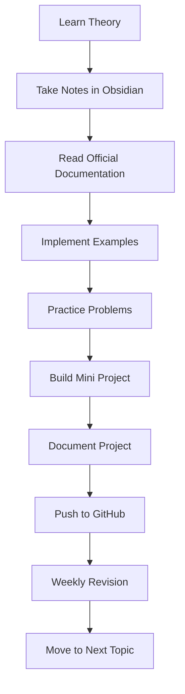

**This file contains common syntax to be followed**

- Definition
- Why
- Syntax
- Example
- Complexity
- Common Mistakes
- Interview Questions
- References

# 📚 Learning Workflow

```text
Learn Theory
      ↓
Take Notes in Obsidian
      ↓
Read Official Documentation
      ↓
Implement Examples
      ↓
Practice Problems
      ↓
Build Mini Project
      ↓
Document Project
      ↓
Push to GitHub
      ↓
Weekly Revision
      ↓
Move to Next Topic
```

## Checklist Version

- [ ] Learn Theory
- [ ] Take Notes in Obsidian
- [ ] Read Official Documentation
- [ ] Implement Examples
- [ ] Practice Problems
- [ ] Build Mini Project
- [ ] Document Project
- [ ] Push to GitHub
- [ ] Weekly Revision
- [ ] Move to Next Topic

## Mermaid Flowchart

